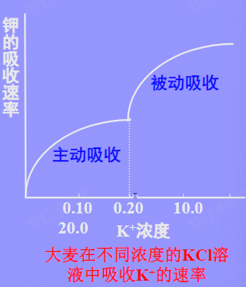
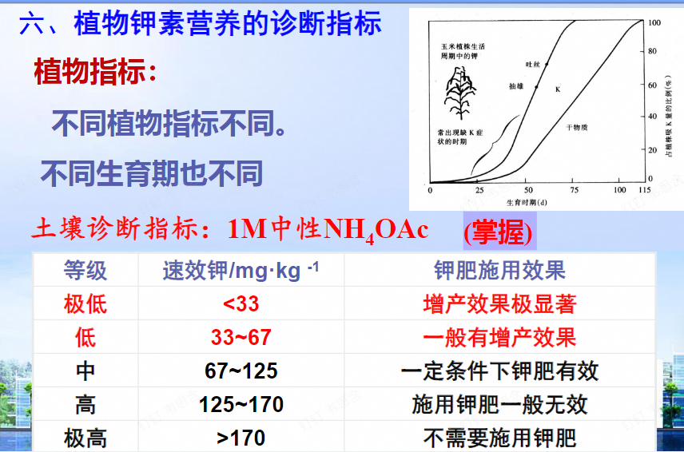
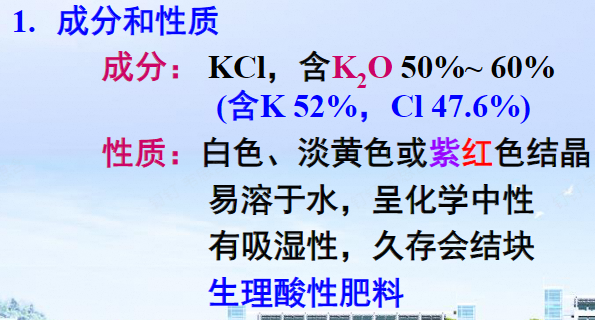
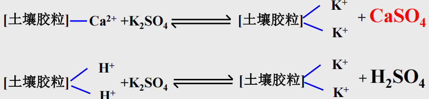
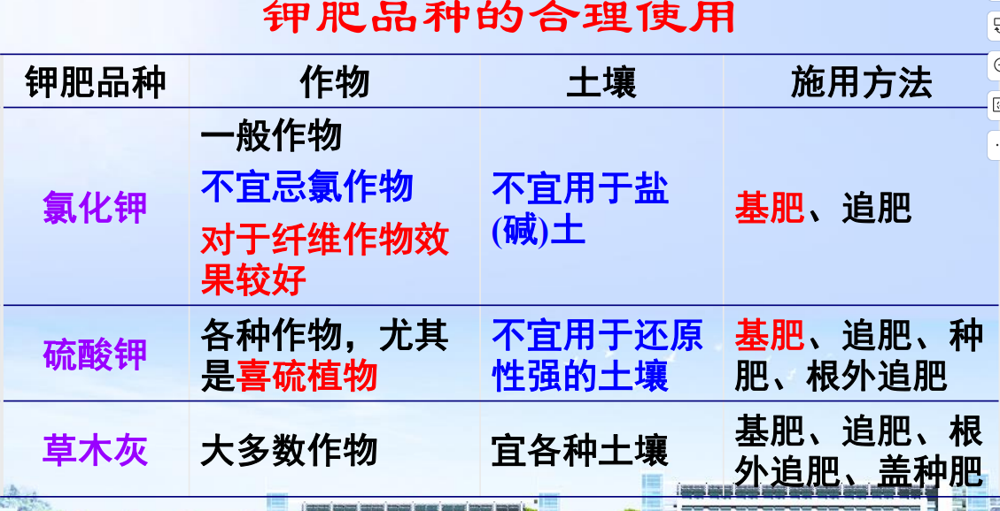

## 一、植物的钾素营养与钾肥
### 1. 土壤中的钾素及其转化
1. 土壤中的钾素含量和形态
	- 全钾量：0.5%~2.5%
	- 分布规律：由北向南、由西向东逐渐减少
	- 形态：矿物态钾、缓效态钾、**速效态钾**→是植物可以利用的形态
2. 土壤中钾素的转化
	- 钾的释放：矿物态钾风化→非交换性钾释放→钾的解吸
	- **钾的固定**： #重点 
		- **晶格固定作用**：有些次生粘土矿物晶层(主要为2:1型粘土矿物)吸水膨胀，使半径与晶格孔隙半径相当的K+进入晶格的孔穴中，而当失水以后晶层收缩，落入孔穴中的 ==K+较难回复到自由状态== 
		- 它难以与其它离子产生离子交换，所以是 ==非交换性钾== 
3. 影响因素： #重点 
	- 粘土矿物组成：2:1>1:1
	- 土壤水分：低土壤含水量限制钾的扩散，降低钾的有效性
	- 温度
	- 干湿交替→引起晶格固定，不利于K的有效性 ^9802db
	- pH：酸性土壤不利于固定→施用石灰
	- 氮磷肥料：氮肥促进植物的生长影响，促进对钾吸收。但在土壤供钾较低的土壤上施用铵态氮肥， ==会阻碍晶层间的钾释放，降低土壤供钾能力== 。磷肥施用（磷酸铵）促进钾的溶解，同时对于喜欢氨的作物，不宜使用钾肥。
#### 2. 植物的钾素营养 
1. 植物体内钾的含量、形态与分布
	- 含量： ==干物重的0.3%~5%== ，淀粉作物、糖料作物、烟草、香蕉等含钾较多；禾谷类作物相对较低
	- 形态：离子态钾
	- 分布：幼芽、幼叶、根尖等代谢活跃部位
2. 营养功能： ^d2a120
	1. 促进酶的活化
	2. 促进光能的利用，增强光合作用
	3. 改善能量代谢
	4.  ==促进糖代谢==  #重点 
		1. 促进碳水化合物形成：活化淀粉合成酶，因此对纤维的合成有利→棉麻作物有重要作用
		2. 促进光合产物的运输
		3. 协调源库关系
	5. 促进氮素吸收和蛋白质的合成
		1. 促进硝酸根的还原和运输：提高了NR的合成并增强其活性
		2. 核酸形成的关键酶需要钾离子激活
	6. 参与细胞渗透调节→膨压
	7. 促进有机酸代谢：钾与苹果酸根结合成为苹果酸钾
	8. 增强作物的抗逆性→碳水化合物、纤维素、渗透式方面入手
	9. 提高根系的氧化能力
		1. 能改善水稻“乙醇酸代谢途径” ，提高根系氧化力→根际Eh升高→防止H2S、过量Fe2+ 、Mn2+和有机酸等物质的危害。
#### 3. 植物对钾的吸收和运输 #重点 
- 吸收(有两个途径，区别于N和P)：
	1. 主动吸收：占主导地位，具有自动调节功能
	2. **被动吸收**：外界K＋浓度过高时，高亲和系统起作用， ==钾转运蛋白== 主要参与该过程；当外界K+浓度在1-10mM时，低亲和系统起作用， ==钾通道蛋白== 主要参与该过程→吸收曲线呈“**二重图型**”
	3. 影响因素
		1. 土壤供钾状况 #一些疑问 
		2. 植物种类：向日葵、荞麦、甜菜、玉米 >油菜、豆科作物 > 禾谷类作物、禾本科牧草
		3. 介质的离子组成： ==钙促进钾的吸收，铵抑制钾的吸收== 
		4. 土壤水气条件：
			1. 水分不足→K+的活度下降，降低了K+的扩散；
			2. 水分过多→通气不良，作物吸钾能力受到抑制
- 运输：木质部和韧皮部向上运输，也可由韧皮部向下运至根部
#### 4. 钾对作物产量和品质的影响→”品质元素“
- 联系[[#^d2a120]]
- 对品质的影响 #重点 
	- 油料作物含油量增加、糖料作物含糖量增加
	- 纤维作物的纤维长度改善
#### 5. 营养失调症状
- 通常茎叶柔软，叶片细长、下披；植株柔弱易倒伏→维管组织发育不良
-  ==老叶== 叶尖和叶缘发黄，进而变褐，逐渐枯萎，有灼烧焦状；叶脉依旧绿色
- 在叶片上往往出现 ==褐色斑点== ，甚至成为斑块，严重缺钾时幼叶也会出现同样的症状；
-  ==玉米尖端空粒== →区别于P[[#^1a7237]]
- 根系生长停滞，活力差，易发生根腐病
- 诊断指标： #一些疑问 是用醋酸铵提取么？ 
## 三、 钾肥的种类、性质及施用 #重点 
#### 1.钾盐矿资源与钾肥制造原理
- 钾矿种类：明矾石、钾长石、光卤石
- 制造方法：氯化钾、硫酸钾
- 我国钾矿资源及其匮乏
#### 2. 常用钾肥的性质和施用
- **氯化钾**： #重点 
	- 适合一般作物， ==不宜忌氯作物== (马铃薯、甜菜、番薯等)
	- KCl,含有K2O
	- 属于 ==生理酸性肥料== ：植物会吸收钾而导致土壤中的H+与氯离子作用，形成盐酸
	- 在土壤中的转化
		1. 阳离子交换
			- 中性/石灰土：会与胶体上的Ca2+作用，形成氯化钙，将其从胶体上置换下来
				- 会导致钙被淋失→板结
				- 可能会导致土壤酸化
				- 但是对于石灰性土，不会被酸化，而且可以释放有效钙，利于植物吸收
			- 酸性土壤：与胶体上的H+ 、Al3+ 、Ca2+产生离子交换→区别于中性土壤 ^9dc431
				- 会导致土壤pH迅速下降
				- 对植物产生铝毒，并且使Ca被淋失
			- 应该配施石灰肥料
		2. 土壤的固定
			- 晶格固定[[#^9802db]]
		3. 释放：非交换性钾→有效性钾
			1. 黏土矿物种类
			2. 田间持续淹水→有效钾增加；暴晒等可以促进土壤含钾矿物的风化→有效钾增加
		4. 淋失：速效性钾→缓效性钾，降低了钾的有效性 ^d32999
			1. 多雨地区和代换量低的砂土淋失量较多。所以钾肥一次用量不宜过多
	- 施用：
		- 可作基肥、追肥施用，不宜作种肥→联系氯化铵→ ==氯离子会抑制种子的萌发== 
		- 在酸性和中性土壤中要与石灰、有机肥等施用
		- 作物：适合一般作物，特别是棉花、麻类等纤维作物
- **硫酸钾**：适合各种作物，尤其喜硫植物 #重点 
	-  ==生理酸性肥料== 
	- 在土壤中的转化
		- 中性和石灰性土壤上生成CaSO4，其溶解度比CaCl2小→土壤脱钙程度较小，酸化速度比氯化钾缓慢；
		- 酸性土壤 [[#^9dc431]]
	- 施用：在通气不良的土壤中尽量少用→会被还原形成硫化氢
- **草木灰**：适用于各种土壤和作物
	- 烧制：植物熏烧后的残灰
	- 成分：含有灰分元素，如微量元素；90％的钾为K2CO3，其中的磷是枸溶性磷，对作物有效
	-  ==化学碱性== 
	- 施用：适用各种土壤和大部分作物
		- 追肥→叶面撒施；种肥→保持土壤湿度，促苗早发
		- 不能与铵态氮肥、腐熟的有机肥料混合施用→以免造成氨的挥发损失
#### 3. 钾肥的合理分配
1.  ==华南地区缺钾的原因==  #重点 
	- 高温多雨，淋溶强烈[[#^d32999]]；矿物类型为1:1型，吸持钾的能力弱→含量低。
	- 耕作制度：复种指数高，植物带走更多的养分
	- 秸秆还田、农家肥比较少
	- 平时氮肥、磷肥施得比较多，钾肥少施
	- 应当将钾肥优先分配在缺钾的砂质土壤上
	3. 固钾能力
	4. 障碍因子
2. 根据土壤特性：
	1. **供钾水平**：土壤中速效性钾的含量和缓效性钾的贮藏量及其释放速度 #名词解释 
	2. 在供钾水平较低时，钾肥的肥效才明显表现。盐土避免施用高量氯化钾，酸性土壤用硫酸钾更有利
		1. 碱土：当大量施用氯化钾时，氯离子会在土壤中积累。这些积累的氯离子会增加土壤溶液的浓度，使得土壤的盐渍化程度进一步加重
		2. 酸性土：硫酸钾施用后，可以与土壤中的铝离子发生反应→减少铝的毒害
3. 根据作物需钾特性：
	- 作物种类：同一作物不同品种需钾量不同
	- 不同生育期需钾量不同：一般作物钾的临界期在苗期，因此**钾肥一般用作基肥**，特别是生育期短的作物。
	- 作物根系特征
		- 须根作物从土壤中吸收的钾比直根作物多→K的移动性小，因此根与土壤接触面积大就吸收更多
		- CEC小的根，吸收一价阳离子较多；CEC大的吸收二价阳离子较多→ ==双子叶植物CEC较大，吸钾能力弱== [[Chapter1 植物养分吸收]]
- 根据钾肥种类
- 养分平衡：
	- 钾与氮、磷配合，利于肥效充分发挥：
		- 一定P水平下，N、K配施时→植株体内K2O/N比值增高，而可溶性非蛋白质氮占全氮的比例降低→NK配合施用可以促进水稻对N、K的吸收及其在体内保持一定的平衡，也促进了N在体内的转化和蛋白质合成。
	- 含有效钾素较多的有机肥料用量高时，可少施或不施化学钾肥
#### 4. 施用技术
- 技术：深施、早施、相对集中施肥