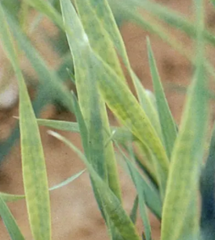

## 一、植物钙素营养
### 1. 植物对钙的吸收和运输
- 含钙量：0.1~5%之间
- 钙的吸收 #重点 
	- 被动吸收为主→尚未形成凯氏带的根尖和侧根
	- 离子竞争：K+ 、NH4 +抑制，硝酸盐促进
- 钙的运输
	- 能够从木质部向上运输，动力为蒸腾作用→钙优先向嫩枝移动：枝条顶端IAA促进质子流出，增加阳离子交换位的形成
	- 但是 ==很难在韧皮部运输== ，因此很难向下→果实、种子中钙含量低
#### 2. 生理功能 #重点 
- 构成细胞壁的重要成分：果胶酸钙
- 稳定膜结构和调节膜的渗透性
- 钙调蛋白的组成→联系生化
-  ==细胞伸长== 所必需：IAA活化细胞膜ATP酶，降低外面的pH，提高细胞壁的弹性和可塑性，可以引起细胞壁变松，促进细胞伸长
- 调节养分离子的生理平衡，消除某些离子的毒害作用
#### 3. 缺钙症状
- 植株矮小、 ==节间较短== 、叶片卷曲
- 发生部位：幼嫩的组织👉会导致生长点坏死
- 番茄、西瓜：脐腐病；苹果：苦痘病（苦陷病）;包菜:空心病
#### 4.喜钙植物和嫌钙植物 #重点 
- 喜钙植物：指分布在pH值和CaCO3含量高的石灰性土壤
	- 双子叶植物，豆科、番茄等，植物含钙高→CEC较高， ==果胶质含有较多的羧酸，能结合较多的钙== 
	- 在酸性土壤不能生长，主要是Al3+的毒害。
- 嫌钙植物：适宜生长在含钙低的酸性土壤上
	- 单子叶植物，水稻、黑麦草等。植物体内钙含量低，CEC低。
##### 5.钙肥种类和施用
- 石灰的改土作用  #重点  ^b21a13
	- 中和酸性，消除铝毒：
		- 酸性土壤使用石灰可以中和土壤活性酸和潜在酸
		- 使用石灰可以使铝生成氢氧化物沉淀，消除铝害。同时也可以清除土壤中过多的铁锰毒害。
- 增加有效养分
	- 酸性土壤施用石灰可以增强土壤微生物的活性→促进有机质的矿化和生物固氮，增加有效养分供给。
	- 使磷的固定减弱，促进无机磷的释放
- 改善土壤物理性状：土壤胶体由氢胶体变为钙胶体，使土壤胶体凝聚，有利于水稳性团粒结构的形成。
- 改善作物品质，减少病害：大部分致病性真菌适于在酸性土壤环境生长。使用石灰可以中和土壤酸性。

## 二、植物镁素营养
#### 1. 植物对镁的吸收和运输
- 含量：0.1-0.5%
- 镁离子的吸收:被动吸收，主要是离子通道，
	- 离子竞争：K+ 、NH4 + 、Ca2+抑制
- 镁的运输： #重点 
	- 根从土壤溶液中吸收的Mg2+通过木质部导管的蒸腾流向地上部运输。可以在韧皮部运输，能从老叶向幼叶或顶部转移，再利用程度高
	- 当植株缺镁时，Mg2+会从老叶转移到幼叶和生长点部位。
	- 果实和贮藏组织中镁含量高于钙。
#### 2. 镁的生理功能
- 构成叶绿素的主要成分→参与光合作用
- 多种酶的活化剂→参与脂肪代谢、核酸与蛋白质合成
#### 3. 植物缺镁症状
- 植株矮小、生长缓慢
-  ==脉间失绿== →会有串珠状脉
## 三、植物硫素营养
#### 1. 植物对硫的吸收和运输
- 植物体内0.1-0.5%
- 吸收运输：主要从土壤吸收SO4 2-离子，也可以从空气吸收少量SO2气体。
	- 方向：向顶部运输
	- 硒酸盐抑制硫的吸收
- 硫的作用:
	1) S is the components of protein andbiomembrane:S-content amino acid and thioester(硫酯）
	2) As a component of enzyme for biochemicalreaction.CoA, ferredoxin (Fd), thioredoxin (Td),nitrogenase.
	3) S constitutes a system for oxidative andreductive reaction: glutathione-SH
#### 2. 缺硫症状→但是田间很少缺硫
-  ==幼嫩部位最先出现== 
- 叶色浅、叶片比较直立
- 豆科植物对缺硫比较敏感
#### 3. 石膏改良碱土 [[#^b21a13]] #重点 
- 碱土主要分布于我国的北方干旱半干旱地区，土壤溶液中含有碳酸钠和重碳酸钠，土壤碱性强，土壤胶体分散，干时板结，湿时泥泞，影响作物生长。
- 施用石膏可以与土壤溶液中的碳酸钠和重碳酸钠反应生形成硫酸钠， ==钙离子置换土壤胶体上的钠离子== ，形成不易分散的钙胶体。因此使用石膏可以改良碱土，提高作物产量。
- 方法：深翻→破坏板结土壤；排灌→排掉碳酸钠
## 四、植物微量元素→Onenote笔记

| 元素     | 含量                   | 吸收和运输                              | 影响有效性的因素                   | 功能                                                                                                                 | 缺乏症状                                                            |
| ------ | -------------------- | ---------------------------------- | -------------------------- | ------------------------------------------------------------------------------------------------------------------ | --------------------------------------------------------------- |
| 铁 (Fe) | 100~300mg/kg         | 主要吸收Fe2+主动运输，机理：通过质子泵酸化根际，分泌还原酶和载体 | 土壤pH，有机酸→形成可溶性螯合物          | 叶绿素合成和呼吸作用的辅助因子→联系电子呼吸传递链                                                                                          | 新叶叶片失绿黄化(区别于Mg和N);叶子薄而光滑,缺少表皮毛                                  |
| 钼 (Mo) | 0.1~300mg/kg         | 被动吸收以MoO₄²⁻形式吸收                    | 土壤pH，有机质含量                 | ①参与氮代谢，固氮酶和硝酸还原酶的组成成分；②促进植物体内有机含磷化合物的合成；③参与光合作用与呼吸作用；④促进繁殖器官的合成                                                    | 老叶叶片失绿，有大小不一的斑点，叶片扭曲，老叶变厚焦枯。缺钼一般发生在酸性土壤中。花椰菜、烟草、油菜“鞭尾状”，柑橘“黄斑病” |
| 锌 (Zn) | 25~150mg/kg。蔬菜植物＞禾本科 | 主动运输，通过锌铁控制运转相关蛋白（ZIP）家族等          | 土壤pH，有机质→络合作用，磷含量→磷锌拮抗；石灰质 | ①参与生长素合成→促进合成色氨酸(IAA的前身)，②酶的活化；③光合作用中CO2的水合作用→叶绿体内膜系统被破坏；④促进蛋白质代谢；⑤促进生殖器官发育和抗逆性                                    | 顶芽生长受阻，节间变短，叶片失绿水稻“矮缩病”和玉米“白苗病”苹果“小叶病较敏感                        |
| 硼 (B)  | 2~100mg/kg           | 被动吸收，通过水通道蛋白                       | 土壤pH，粘土矿物含量，有机质含量          | ① ==细胞壁== 合成；② ==糖运输与代谢== 缺硼时形成堵塞筛孔；③ ==花粉萌发与花粉管生长== ；④细胞伸长与分裂→IAA大量积累，但IAA氧化酶活性降低，且扩散受阻；⑤调节酚的代谢与木质化作用→缺少时黑化；⑥提高根瘤菌的固氮能力 | 茎和根生长点坏死，叶片变厚变脆畸形。“花”而不实，根粗短而有褐色                                |
| 锰(Mn)  | /                    | Mn2+与螯合态                           | /                          | 同样作为酶的激活剂                                                                                                          | 新叶。叶片失绿并出现 ==杂色斑== 点(区别K和Mg)，而叶脉保持绿色                              |
| 氯(Cl)  | 340~1200mg/kg        | 逆化学梯度的主动吸收，以共质体途径为主                |                            | 喜氯作物:大麦、玉米、番茄、菠菜  忌氯作物：烟草、菜豆、马铃薯                                                                             | 中毒症状：叶缘似烧伤                                                      |