## 一、土壤的形成与矿物组成 #重点 
#### 1. 土壤中的矿物
- 矿物 (mineral)：天然产生于地壳中的单质和化合物 #名词解释 
- 岩石 (rock)：矿物的集合体
- 土壤的元素组成(%)：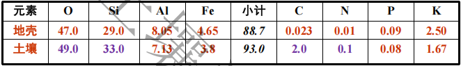
	- 与地壳元素相比：氧硅铝铁较多
- 土壤的矿物组成
	- 矿物来源→产生与地壳的矿物质
		- 原生矿物：岩浆岩； ==没有改变化学组成== [[#^a2faf6]]
			- 石英，长石，云母，氧化铁类矿物、方解石→土壤中碳酸钙的主要来源
		- 次生矿物：新形成的矿物
			- 高岭石，伊利石，蒙脱石、氧化铝
	- 结晶状态：结晶质、非结晶质
#### 2. 风化
- 风化作用：岩石在地表受到种种外力作用，逐渐破碎成为疏松物质 #名词解释
	- 物理风化作用
		- 温度→冻结
		- 特点：成分未变、颗粒较粗，多偏砂、石砾多；养分不宜释放
	- 化学风化作用→水和空气→成分改变，较稳定的 ==次生矿物== 
		- 溶解：碳酸钙→碳酸氢钙
		- 水化：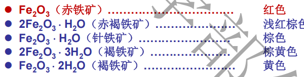
		-  ==水解== ：最基本、最主要
			- 长石→高岭石；磷灰石→碳酸二氢钙
		- 氧化：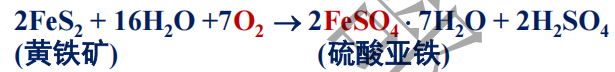
	- 生物风化作用：地衣、苔藓；根系挤压；植物呼吸
- 风化物类型
	- 成土母质：矿物岩石经各种风化作用后形成的疏松多孔体→介于土壤与岩石之间
		- 与岩石相比：释放少量矿质养分、通气性、透水性
		- 与土壤相比：缺乏养分，不含氮、碳，通气性和蓄水性不能同时解决
	- 母质类型：就地堆积；搬运，各种沉积物 #一些疑问 啥意思
#### 3. 土壤的形成和土壤剖面的发展
- 裸露岩石→成土母质→原始土壤→成熟土壤
- **土壤形成过程**：地壳表面的岩石风化体及其搬运的沉积体，受其所处环境因素的作用，形成具有一定剖面形态和肥力特征的土壤的历程。 #名词解释 
- 剖面的发育
	- 土壤自然剖面 #重点 
	- 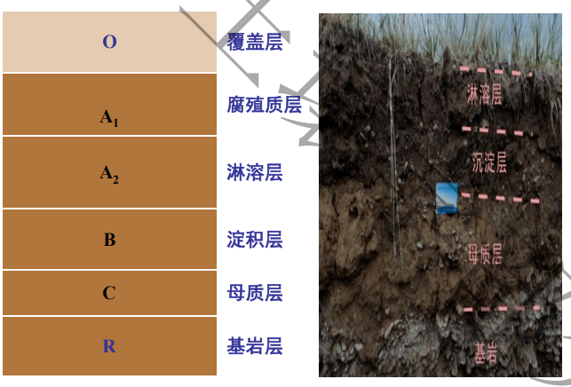
- 影响因素：母质、气候、地形、生物和时间共同作用
## 二、土壤粒级
#### 1. 土地分级制
- 粒级：矿物颗粒大小和性质
- 分级标准 #重点  #待解决 
	- 国际制
	- 卡钦斯基制：2 0.2 0.02 0.002
		- 石砾1~3mm
		- 物理性沙砾 ==0.01mm== -1mm
			- 0.01mm：可塑性和胀缩性，吸湿水力、保肥力和黏结力 #重点 
		- 物理性黏粒<0.01mm
#### 2. 粒级的基本性质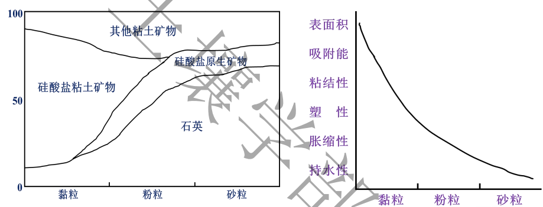
- 砂粒：石英、正长石、白云母
- 黏粒：次生粘土矿物
## 三、土壤颗粒组成和质地分类
#### 1. 土壤颗粒组成
- 颗粒组成：砂黏程度，机械组成
#### 2. 土壤质地分类
- 人为划分：砂土、壤土、黏土
- 质地分类制： #待解决 #重点 
	1. 国际制土壤质地分类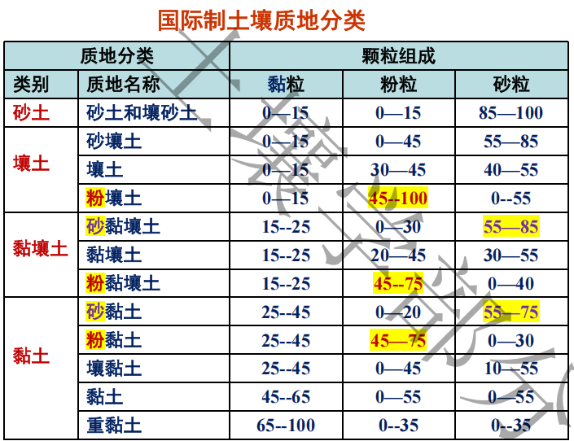
		- 4类12种：砂土，壤土，黏壤土和黏土→比人为多了一个黏壤土
		-  ==以黏粒含量为主要标准== ：15%以下为砂土、壤土类，15%—25%为黏壤土类，25%以上为黏土类
		-  ==粉粒、砂粒含量做帽子== ：当土壤含粉粒>45%时， 粉质；当砂粒含量在55%­~85%时， 砂质；当砂粒含量>85%时，则称壤土、砂土
	2. 卡钦斯基制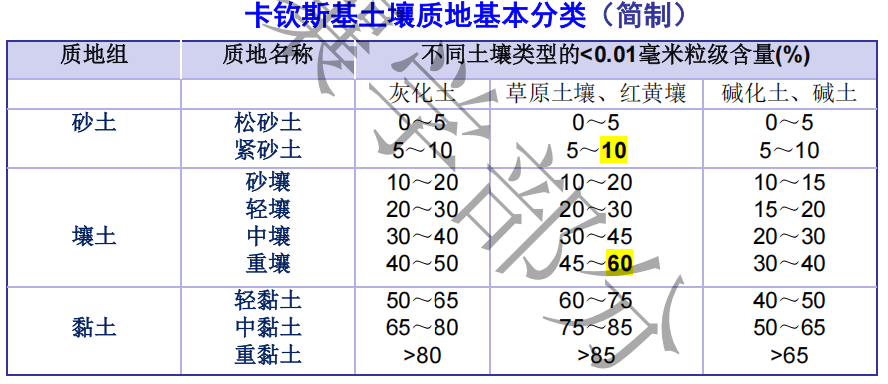
		- 物理性黏粒<0.01mm，物理性砂粒0.01~1mm
		- 土壤类型 #待解决 
## 四、土壤质地与肥力的关系
#### 1. 土壤质地与肥力 #重点 
- 砂质土：“热性土”→抗旱能力强 ==不宜种水稻== ，宜种花生、薯类和瓜类
- 黏质土：“冷性土”→蓄水量大→ ==禾谷类作物== 如小麦，水稻，玉米
- 壤质土：理想土壤，适宜种植各种作物
#### 2. 过砂过黏土壤的改良
- 客土法
- 引洪漫淤法
- 有机肥(最佳方法)

## 五、黏粒矿物
- 黏粒矿物：分布在黏粒部分
	- 层状硅酸盐矿物(晶型)
	- 氧化物类(晶型/非晶型)
#### 1. 层状硅酸盐黏土矿物 #重点 
- 基本结构特征：
	- 外部形态：结晶颗粒
	- 内部形态：硅氧四面体(半径1.32埃)+铝氧八面体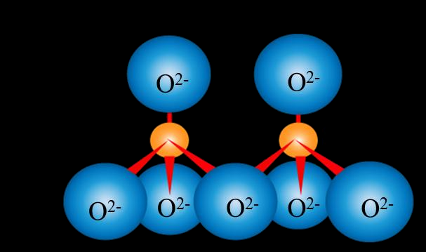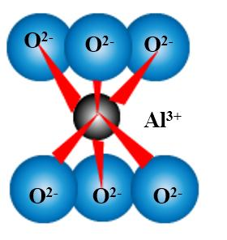
- 单位晶片→这一部分需要结合图像理解 #重点 
	- 类型 ^bb2af8
		- 1:1型单位晶层→无同晶替代现象
			- 由于铝氧八面体中铝离子的电荷较高、半径较小，具有较强的极化能力→当它与氧离子结合时，会使部分氧离子的电子云发生偏移→氧的电负性增强→形成羟基
			- 硅氧四面体片的顶端氧原子与铝氧八面体的羟基形成 ==氢键== 
			- 水分子难以进入晶层间→ ==胀缩性较小== 
		- 2:1型单位晶层
			- →层间距较大→存在广泛的同晶置换现象
				- 镁离子等进入→电荷不平衡→CEC较大→膨胀型
				- 钾离子等进入→填充在层间域，起到稳定晶体结构→非膨胀型
		- 2:1:1型单位晶层：多了一个八面体水镁片
	- 相关概念：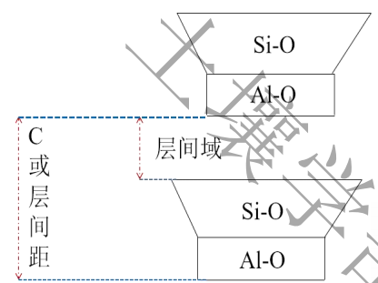
		- 层间域 I
		- 层间距 C
- **同晶替代**：大小相近、电荷符号相同取代，晶格外型不变 #名词解释 
	- 四面体：硅14可以被铝13替代；八面体：镁离子可以替代铝离子
	- 一般是低价取代高价→会导致矿物带电，从而影响土壤的肥力
	-  #待解决 为什么硝酸根和铵根容易被淋失？
- 类型：[[#^bb2af8]] #重点 #待解决 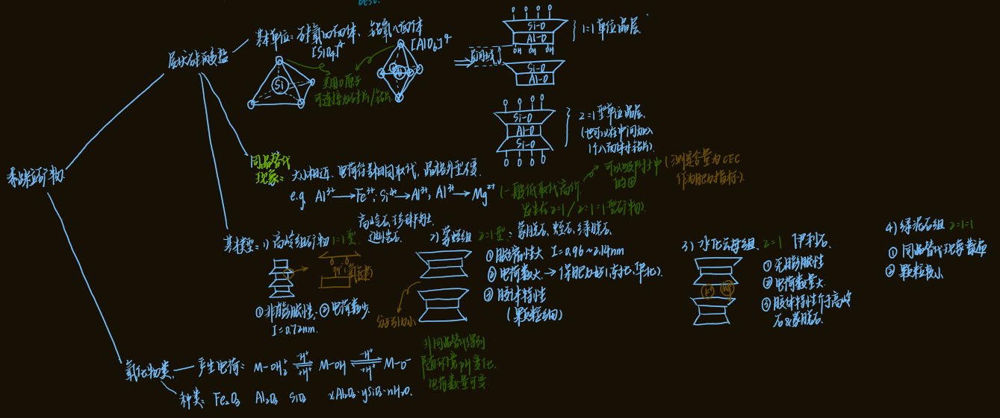
	- 高岭组→1:1型
		- 非膨胀性：I=0.72nm
		- 电荷数量少：3-15 Cmoles(+)/kg
		- 胶体特性弱，分布在南方亚热带土壤
		- 代表：高岭石、珍珠陶土、埃洛石
	- 蒙蛭组→2:1型膨胀性矿物
		- 涨缩性大→I=0.96~2.14nm
			- 晶层间结合力很弱， ==水分子容易进入晶层间== ，导致晶层间距因水分的进入而扩张，因失水而收缩，胀缩性大
		- 电荷数量大： 80~120 Cmoles(+)/kg
		- 胶体特性突出
		- 代表：蒙脱石、绿脱石、蛭石
	- 水化云母组→2:1型非膨胀性矿物
		- 胀缩性小
			- 在晶层之间吸附有钾离子→ ==钾离子受到相邻两晶层负电荷的吸附== ，对相邻两晶层产生了很强的键联效果→晶层不易膨胀
		- 电荷数量较大→CEC： 20~40 Cmoles(+)/lg
		- 胶体特性：介于高岭石和蒙脱石之间
		- 分布：华北、西北干旱地区高，南方土壤低
	- 绿泥石组→2:1:1型
		- 代表：绿泥石→富含镁和铁
		- 同晶替代普遍，元素组成大，10~40 Cmoles(+)/kg
		- 颗粒较小
		- 分布：沉积物和河流冲积物
#### 2. 非硅酸盐黏粒矿物——氧化物类^a2faf6
- 主要特点：
	- 电荷不是由同晶替代产生的
	- 电荷数量可以随着环境pH变化
	- 性质差异较大
- 分类
	- 氧化铁：赤铁矿、针铁矿、褐铁矿
	- 氧化铝：土壤中三水铝石的含量可作为脱硅作用和富铝作用的指标，主要分布在热带、亚热带高度风化的 ==酸性土壤== 中
		- 起重要作用的主要是非晶质（无定形）的铁铝氧化物。非晶质的铁铝氧化物可以吸附阴离子，如土壤中磷酸根离子的吸附，使磷被固定，失去其有效性
	- 水铝英石：无定形硅酸铝  #一些疑问 那和上面的有什么区别？
		- 由氧化硅、氧化铝和水组成，Si/Al比在1－2之间变化
		- 阳离子交换量，为10－15 Cmoles(+)/kg
		- 温带半湿润和湿润地区以及热带地区玄武岩和火山灰发育的幼年土壤中、有些森林覆盖、高海拔、低温、中高雨量条件下的土壤，其心土层中也存在水铝英石
	- 氧化硅：
		- 结晶态：α-石英
		- 非晶质：蛋白石
			- 经过进一步脱水结晶后→玉髓、石英、方英石和磷石英
			- 土壤蛋白石含量与土壤腐殖质含量密切相关
