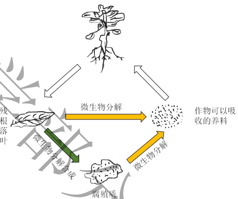
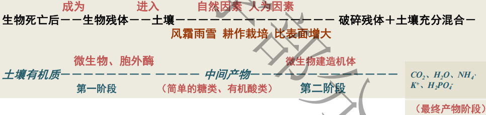
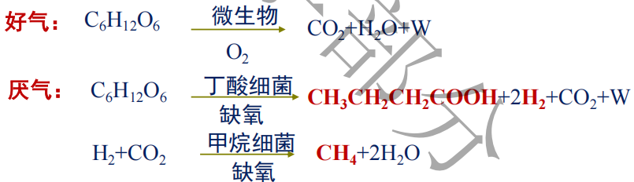
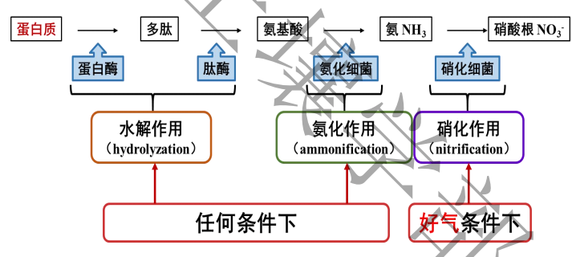
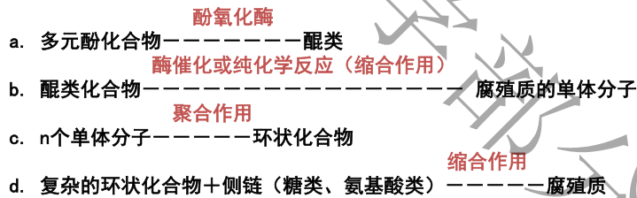

## 一、有机质来源及其组成
#### 1. 有机质
- 定义:含碳有机化合物
- 根据分解程度，分解85~90%的为腐殖质
- 耕地土壤有机质含量一般在0.5~5%
#### 2. 组成
- 动、植物残体：基本(植物残体量变异大)
	- 糖类化合物、纤维素、脂肪、树脂、木质素、含氮化合物
- 微生物
- 人为施用
## 二、土壤有机质的分解和转化
#### 1. 矿化作用
- 含碳的矿化过程：
	- 纤维素、淀粉在水解酶作用下分解为葡萄糖
		- 好气条件：葡萄糖氧化变成CO2和水，释放能量
		- 厌气条件：葡萄糖在丁酸细菌的无氧分解条件下， ==生成丁酸，放出氢气== ；氢气与二氧化碳在甲烷细菌作用下放出甲烷
- 含氮的矿化过程
	- #一些疑问 旱地和水田土壤有什么差异？
#### 2. 腐化作用
- 合成过程
	- 第一阶段：中间产物生成
		- 有机残体→ ==多元酚== 、糖类、氨基酸→二氧化碳、水和铵根等
	- 第二阶段：合成腐殖质
		- 多元酚→醌类化合物→腐殖质的单体分子→合成环状化合物→添加侧链得到腐殖质
- 腐殖化系数:有机物质转化成有机质的换算系数→0.2~0.5 #考过 #名词解释 
#### 3. 两者的关系
- 相互对立又相互联系
- 矿质化过程提供原料
-  #待解决 耕地有机质增加还是下降？
#### 4. 转化的影响因素
- 环境因素
	- 水分、通气→影响微生物的活性
	- 温度：25~35℃
	- pH:细菌适宜的pH在6.5~7.5，放线菌稍偏碱；真菌 pH 3~6
	- 含盐量：盐>0.2%时，微生物的活动减弱→分解变慢
- 植物残体的特性
	- 物理状态
	- 组成
	- C/N比：不同的物种中不一样，禾本科中为80:1，微生物中25~30:1 #一些疑问 能用来说明什么？
		- 如果过大，微生物与植物争 N；
		- 较小则有机残体分解快
## 三、土壤腐殖质
#### 1. 基本概念
- 概念：通过微生物的作用产生的一类高分子化合物
- 存在状态：游离态、大多是结合态
- 根据溶解性分为 #待解决 溶解性有啥区别？
	- 胡敏酸（Humic acid, HA）→黑色，分子量大，带电量多，酸性弱→含C多；一价盐溶于水
	- 富啡酸（Fulvic acid, FA）→黄色，分子量小，带电量少，酸性强→O+S较多；溶于水
	- 胡敏素（Humin, HM）
#### 2. 理化特征
- 元素组成：
	- C(58%)、H、O、N(5.6%): >90%
	- 灰分元素：Ca、Mg、K、Na、Si、P、S、Fe、Al、Mn，8%
- 分子结构
	- C网结构：醌型芳香核物质
	- 功能团：甲氧基(-OCH3)、羧基(-COOH)、羟基(-OH)、胺基（－NH2）、羰基（－C＝O）→影响了带电量
	- 吸水性大
- 稳定性和变异性
	- **HA/FA值**：腐殖质变异；形成条件和复杂程度 #重点 #一些疑问 如何影响土壤肥力 
		- 自东向西比值减少
		- 北方>1，以胡敏酸为主；南方<1，以富啡酸为主
		- 水稻土>旱地 #一些疑问 如何理解？
		- 熟化程度高 HA/FA 较高
## 四、土壤有机质在肥力上的作用

1. 提供植物所需养分
2. 改善土壤肥力特性
	1. 促进良好结构体的形成：降低土壤粘性，改善土壤耕性；降低土壤砂性，提高保蓄性；
	2. 促进土壤升温。
	3. 影响土壤的电荷性质、缓冲性
	4. 影响植物的根系生长，为动物提供食物来源
3. 减轻和消除土壤中的农药残毒及重金属危害

## 五、耕地土壤有机质的调节
#### 1. 措施
- 合理的耕作制度→退化/熟化 #一些疑问 束花是啥意思
- 施用有机肥
- 种植绿肥：田菁 紫云英 紫花苜蓿等
- 秸秆还田：注意C/N比 #一些疑问 为啥？
#### 2. 计算示例
- 1公顷土壤表层土重：2300,000kg , 有机质 2%；矿化率2%, 实行秸秆还田500kg （干重）→腐殖化系数为0.31，问此耕地土壤有机质含量会不会下降？
	- 原有机质：2300,000kg×2%(有机质含量)=46,000 kg
	- 消耗：46,000kg×2% (矿化速率) =920kg
	- 秸秆还田：500kg×0.31=155 kg