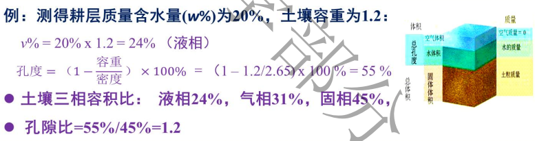
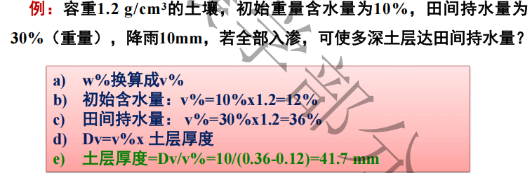
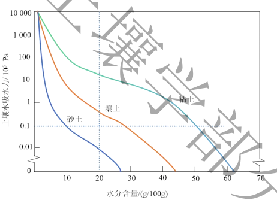

## 一、土壤含水量
#### 1. 质量含水量(w%)
- w% = 土壤水质量/干土质量 ×100% =(w1-w2)/w2
#### 2. 容积含水量(v%)
- v% = w% x 土壤容重
#### 3. 贮水量容积：以水的容积表示
- 土壤贮水量(方) = 土壤容积 x ==容积含水量(v%)== =土地面积 x 土层深度(m) x容积含水量(v%)
	- 1亩 = 667㎡ #重点 
#### 4. 贮水量深度
- 贮水量深度(Dv)=容积含水量(v%) x 土层厚度
#### 5. 相对含水量
- 大田作物的适宜范围：60~80%
- 相对含水量=绝对含水量/田间持水量
## 二、土壤水分类型、水分常数及有效水
#### 1. 土壤水分的类型
- 吸湿水(紧束缚水)→对植物无效
	- 概念：干燥的土粒中的水汽分子
	- 吸湿系数：当相对湿度达 100%时，土壤吸湿量达最大值，这时的含水量称吸湿系数或最大吸湿量
- 膜状水(束缚水)：液态水

#### 2. 水的有效性
## 三、土水势
#### 1. 土水势
- 概念：水的自由能-标准状态水自由能(=0)
- 土壤中水所受的力→基质吸力(范德华力+氢键)+渗透力(溶质)+重力+静水压力
	- 基质势Ψm ：土粒吸附力和毛管力，负值
	- 溶质势Ψs ：渗透势，溶质，负值
	- 重力势Ψg ：重力作用，参照面（地下水）之上， ==正值== 
	- 压力势Ψp ：静水压力， ==正值== 
#### 2. 土壤水分特征曲线
- 能够看出什么？
- 影响因素
	- 质地
	- 结构
	- 温度
	- 滞后现象 #待解决 
- 用途：
	- 可利用它进行土壤水吸力和含水率之间的换算；
	- 可以间接地反映出土壤孔隙大小的分布； #一些疑问 咋反映？
	- 可用来分析不同质地土壤的持水性和土壤水分的有效性；
	- 应用数学物理方法对土壤中的水运动进行定量分析时, 水分特征曲线是必不可少的重要参数