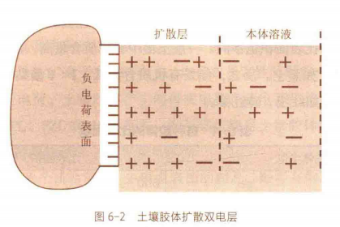
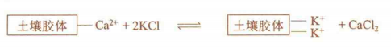
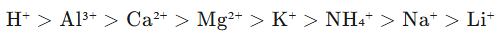

## 一、基本概念
#### 1. 土壤胶体
- 概念：土壤胶体颗粒和土壤溶液组成的胶体分散体系，土壤中较细小且活泼的部分，直径一般在1~100nm
- 性质：巨大的比表面和表面能、 ==带有电荷== 
- 土壤胶体的种类
	- 矿质(无机)胶体
		- 结晶态
		- 非晶质
	- 有机胶体：主要是腐殖物质
	- 有机-矿质复合体：占60-95%
#### 2. 胶体电荷
- 土壤电荷主要集中在胶体部分→对离子吸附又重要作用
	- 永久电荷：粘土矿物晶格中离子 ==同晶置换产生的== [[Chapter2 土壤矿物质]]，不受环境的影响,是 2:1 型矿物电荷的主要来源。
	- 可变电荷：由于土壤固体表面从介质中吸附离子或向介质中释放离子而引起，其中最常涉及的离子是 H+离子和 OH- 离子。
- 构造
	- 双电层
## 二、土壤的阳离子交换
#### 1. 交换性阳离子
- 概念：吸附在土壤表面且可以被溶液中的另一种阳离子交换而从胶体表面解吸的阳离子
	- 致酸离子：H+ ，Al3+
	- 盐基离子：Ca2+，Mg2+，K+ ，Na+ (除 Al 以外的金属离子)
- 影响阳离子交换能力的因素：
	- 电荷的多少：3 价>2 价>1 价
		- 遵循等价离子交换的原则→等量电荷对等量电荷的反应
	- 离子半径和水化半径。离子真实半径上升，水化半径下降，吸着力下降，交换能力提高。
	- 离子浓度：受质量作用定律支配，交换能力弱的离子如果浓度足够大，可以将交换能力强而浓度低的离子交换下来。
1. 土壤吸收性
	- 离子、分子和粗悬浮物质
	- 机械吸收、物理吸收、化学吸收、生物吸收、**物理化学吸收(静电吸引)**
#### 2. 土壤阳离子交换量CEC #重点 
- 概念：单位质量土壤所含的 ==全部交换性阳离子总量== ，单位cmol(+)/kg，表示土壤所能吸附和交换的阳离子的容量
	- 影响因素
		- 土壤胶体含量：黏土＞砂土
		- 土壤胶体种类
		- 土壤pH
	- 北方＞20，南方＜20；水田为15，可作为保肥力指标
- **土壤盐基饱和度(base saturation)**：土壤中 ==交换性盐基离子== 总量占阳离子交换量的百分数
	- 南方土壤致酸离子较多，盐基饱和度小；
	- 北方反之，Ca(2+)与Mg(2+)占大部分比例
	- 盐渍化土壤中Na(+)和K+占比大