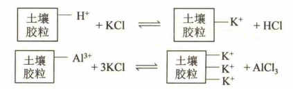
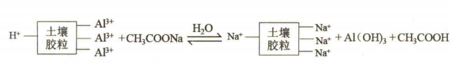
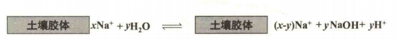
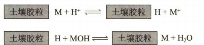
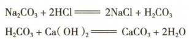
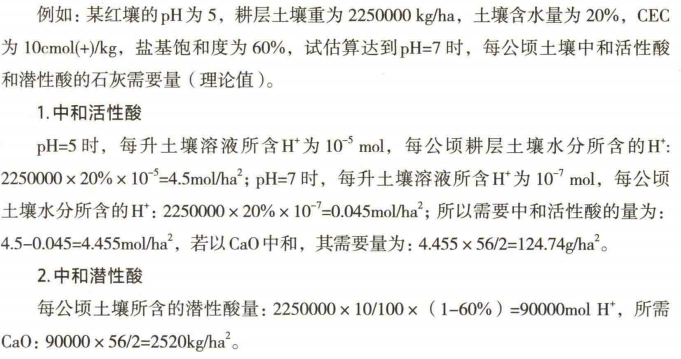
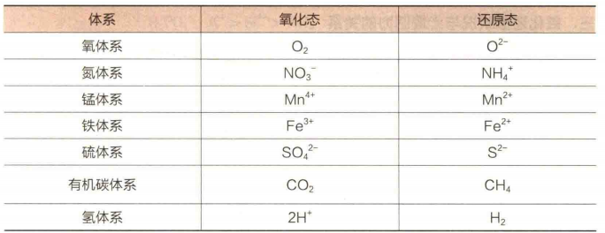
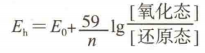

## 一、土壤酸碱性
#### 1. 土壤酸度
- 土壤酸的类型 #待解决 
	- **活性酸**：土壤固相与土壤溶液处于平衡状态时， ==土壤溶液中的H(+)== 所表现的酸度(pH)→数量指标
		- 把 pH 试纸放入土壤溶液中，试纸颜色变化所反映的酸度主要是活性酸的作用
		- 来源：水、碳酸、有机酸			
		- 分布：南酸北碱(中性：6.5~7.5)
	- **潜性酸**：土壤胶体上 ==吸附的H(+)和Al(3+)== 被盐类溶液中的盐基交换后所表现的酸度(单位：cmol(+)/kg)→强度指标
		- **交换性酸度**： ==中性盐溶液== 与土壤作用，将吸附的H(+)和Al(3+)交换下来
			- pHKCl:以1mol/L KCl浸提土壤所得到的交换性酸度
			- pHH2O:土壤活性酸度，一般大于上者(土壤呈酸性)
		- **水解性酸度**：用 ==弱酸强碱盐== 溶液浸提土壤
	- 两者关系：
		- 同一种酸的不同的表现形式
		- 可以相互转化
		- 潜性酸是活性酸的储备
- 酸性土壤的成因：
	- 气候因素：南方下雨比较多，导致阳离子被H(+)交换，形成潜性酸
	- 生物作用：微生物和植物呼吸产生CO2→碳酸；有机酸
	- 施肥和灌溉的影响
#### 2. 土壤碱性
- 形成机理：
	1. 弱酸强碱盐：会解离出OH(-)
	2. 土壤吸附的钠离子的解离
- 表示方法：
	1. pH
	2. **总碱度=CO3(2-)+HCO3(-)**，单位cmol(+)/L，液相
		- 一般是由 ==碳酸钙、碳酸镁== 等溶解性小的石灰性物质引起，弱碱性→石灰性反应
		- 去野外随身带稀盐酸→滴定看是否有气泡产生→鉴定石灰性反应
	3. **碱化度(钠饱和度,ESP)**：5-20%→碱化土，大于20%→碱土
	- 形成原因：
		- 气候因素：在干旱、半干旱地区降雨少，盐类不易淋失，同时底层盐基随水分蒸发上升而积累在土壤表层
		- 母质的影响
		- 其它：过量使用石灰、海水浸渍
## 二、土壤的缓冲作用
#### 1. 土壤的缓冲作用
- 概念：
	- 广义：外界环境变化
	- 狭义：土壤对酸碱变化的抵抗能力
- 缓冲作用机制：
	1. 胶体缓冲作用（固相缓冲）：
	2. 土壤溶液缓冲作用（液相缓冲）：
- 影响因素
	- 阳离子交换量：越大，对酸和碱的抵抗能力越强→看盐基饱和度
	- 盐基饱和度：越高→对酸的饱和能力越大；越低→对碱的包和能力越大

## 三、土壤酸碱性对土壤肥力和植物生长的影响
1. 影响土壤微生物的活动：真菌对pH不是很严格，但细菌和放线菌大部分喜欢中性；如果土壤酸化会产生致病菌→番茄青枯病
2. 影响土壤养分有效性
3. 影响植物生长：不同植物喜欢不同的pH，大部分在中性和酸性，此时营养比较充足；但是茶树、映山红很喜欢酸性→ ==”指示植物“== 

## 四、土壤酸碱性的调节
#### 1. 酸性调节
- 石灰质肥料：中和活性酸和潜性酸、增加Ca(2+)→桥键作用，改良土壤结构→要针对其盐基饱和度低的缺点
	- 石灰需要量
		- 如果太多了可能会土壤过碱、影响其它阳离子有效性
		- 以潜性酸计算：
			- 交换性酸/水解性酸
			- CEC和盐基饱和度
		- **石灰需要量=土壤体积×容重×CEC×（1-盐基饱和度）**，单位：kg/公顷
	- 石灰常数：石灰石粉1.3；生石灰0.5
	- 中和酸的计算
		- tips：这里不用×容重是因为耕层土壤就是干土重量 #待解决 我忘了。
#### 2. 碱性调节
- 使用有机肥：释放CO2、有机酸
- 使用含硫化合物
- 使用酸性肥料
- 使用石膏、碳酸钙

## 五、土壤氧化还原性
#### 1. 土壤氧化还原体系
- 氧化物质：左侧氧化态物质
- 还原物质：有机质
- **氧化还原电位(*Eh*)**：由于土壤溶液中氧化态物质和还原态物质的浓度关系而产生的电位，单位是mV
	- E0为标准氧化还原电位，n为电子转移数
	- Eh：土壤通气性的指标
#### 2. 与土壤肥力的关系
1. 指示土壤通气与排水状况
	- 氧化：
		- Eh＞400mV，旱作有利 水稻不宜 
			-  ==旱作有利== ：土壤氧气充足→根系可以正常进行有氧呼吸，同时土壤中的养分（如硝态氮、氧化态铁和锰）更容易被植物吸收
			-  ==水稻不宜== ：水稻的根系适应了还原环境，在高氧化还原电位（Eh 高）的土壤中，水稻根系会因为氧气过多而失去其适应性，导致根系功能受损；抑制水稻根系分泌氧气以形成氧化层→影响其对还原性毒物（如 Fe²⁺、Mn²⁺ 和 H₂S）的耐受能力。
		- 200~400mV，旱作受影响 水稻正常生长
	- 还原：
		- 强度还原：铁（Fe²⁺）和锰（Mn²⁺）以还原态存在，这些还原态的离子可能对植物有毒性作用。
2. 影响土壤养分形态和供应情况： ==300mV== 
	- >300mV,土壤氧化状态→有机质分解快→旱作有利
3. 强还原状态下土壤有毒物质的产生和积累：Fe²⁺、Mn²⁺ 和 H₂S
4. 影响土壤微生物群落结构 
